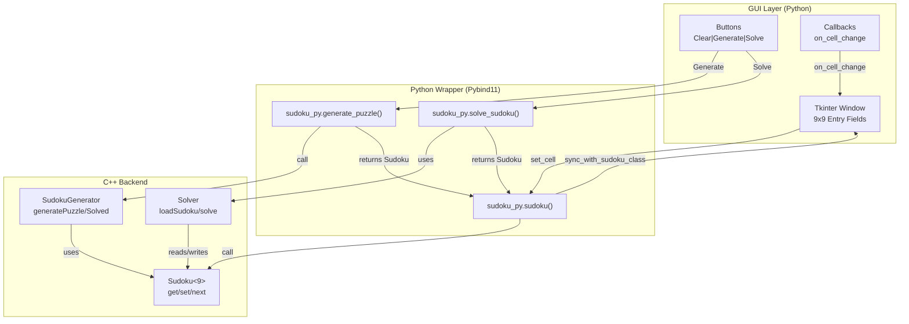

# Sudoku System — Architektur & Datenflüsse

## 1. Komponenten-Übersicht

```
┌─────────────────────────────────────────────────────────────────┐
│                    Python GUI (Tkinter)                          │
│                   sudoku/python/sudoku.py                       │
│                                                                  │
│  • 9x9 Entry-Felder (StringVar + Callbacks)                     │
│  • Buttons: Clear, Generate, Solve                              │
│  • UI-Synchronisation via sync_with_sudoku_class()              │
└────────────────────────┬────────────────────────────────────────┘
                         │
                         │ Import & API Calls
                         ▼
┌─────────────────────────────────────────────────────────────────┐
│              Pybind11 Python Binding Module                      │
│                sudoku/python/python_wrapper.cpp                 │
│                                                                  │
│  Exponiert C++-Klassen als Python-Objekte:                      │
│  • sudoku_py.sudoku()       ─► Sudoku<9> C++                    │
│  • sudoku_py.generator      ─► SudokuGenerator C++              │
│  • sudoku_py.solver         ─► Solver C++                       │
│  • sudoku_py.solve_sudoku() ─► Helper-Funktion                  │
│  • sudoku_py.generate_puzzle() ─► Helper-Funktion               │
└────────────────────────┬────────────────────────────────────────┘
                         │
                         │ Native Calls (C++ Binding)
                         ▼
┌─────────────────────────────────────────────────────────────────┐
│                  C++-Backend (sudoku/src)                        │
│                                                                  │
│  ┌──────────────────────────────────────────────────────────┐   │
│  │ Sudoku<9> Class (sudoku.hpp)                             │   │
│  │ ────────────────────────────────────────────────────────  │   │
│  │ • get(row, col) → char                                   │   │
│  │ • set(row, col, char) → bool (validates Sudoku rules)    │   │
│  │ • next() → (row, col) (finds next empty cell)            │   │
│  │ • operator<< (for printing)                              │   │
│  └──────────────────────────────────────────────────────────┘   │
│                                                                  │
│  ┌──────────────────────────────────────────────────────────┐   │
│  │ SudokuGenerator Class (generator.hpp/cpp)                │   │
│  │ ────────────────────────────────────────────────────────  │   │
│  │ • generateSolved() → Sudoku<9> (vollständiges Sudoku)    │   │
│  │ • generatePuzzle(difficulty) → Sudoku<9> (Rätsel)        │   │
│  │ • writeToFile(sudoku, filename) → bool                   │   │
│  │ • Hilfsfunktionen: fillDiagonal, solveSudoku, etc.       │   │
│  └──────────────────────────────────────────────────────────┘   │
│                                                                  │
│  ┌──────────────────────────────────────────────────────────┐   │
│  │ Solver Class (solver.hpp/cpp)                            │   │
│  │ ────────────────────────────────────────────────────────  │   │
│  │ • loadSudoku(path) → bool                                │   │
│  │ • loadSudoku(reference, base_path) → bool                │   │
│  │ • solve() → size_t (Anzahl Lösungen)                     │   │
│  │ • solve_cell() (privat, rekursiv)                        │   │
│  │ • write_solution() (speichert in results/)               │   │
│  └──────────────────────────────────────────────────────────┘   │
└─────────────────────────────────────────────────────────────────┘
```

---

## 2. Datenfluss: Benutzer-Aktionen

### Szenario A: Benutzer gibt eine Zahl ein

```
User tippt "5" in Feld (3, 2)
        │
        ▼
Entry StringVar ändert sich
        │
        ▼
on_cell_change(row=3, col=2, value="5") callback
        │
        ├─ Validierung in Python (isdigit, 1-9)
        │
        ▼
set_cell(3, 2, "5")
        │
        ├─ Normalisierung: "5" → '5' (char)
        │
        ▼
self.sudoku.set(3, 2, '5')  ◄──── Python → C++ (pybind11)
        │
        ▼
Sudoku<9>::set(3, 2, '5') C++ Funktion
        │
        ├─ Regelprüfung: Ist '5' in Zeile/Spalte/Block schon vorhanden?
        │
        ├─ Falls UNGÜLTIG: return False
        │   └─► Python: entry.config(bg="red")
        │
        └─ Falls GÜLTIG: return True
            ├─ Wert eintragen: field[3][2] = 5
            ├─ Bitsets updaten: rows[3].set(4), cols[2].set(4), blks[...].set(4)
            └─► Python: entry bleibt normal (weiß)
```

### Szenario B: "Generate" Button

```
Benutzer klickt "Generate" Button
        │
        ▼
generate() aufgerufen
        │
        ├─ self.sudoku = sudoku_py.generate_puzzle(40)  ◄──── Python → C++
        │
        ▼
SudokuGenerator::generatePuzzle(40) C++
        │
        ├─ generateSolved()
        │   ├─ fillDiagonal() — Füllt 3 Diagonalblöcke
        │   ├─ solveSudoku() — Löst per Backtracking
        │   └─ Rückgabe: vollständiges, gültiges Sudoku
        │
        ├─ Entfernt zufällig 40 Felder (unter Beibehaltung eindeutiger Lösung)
        │
        └─ Rückgabe: Puzzle als Sudoku<9> Objekt  ◄──── C++ → Python
                │
                ▼
        sync_with_sudoku_class()
                │
                └─ Für jedes Feld: value = self.sudoku.get(r, c)
                   └─ Füllt Entry-Felder mit Werten aus dem neuen Puzzle
```

### Szenario C: "Solve" Button

```
Benutzer klickt "Solve" Button
        │
        ▼
solve() aufgerufen
        │
        ├─ solved = sudoku_py.solve_sudoku(self.sudoku)  ◄──── Python → C++
        │
        ▼
solve_sudoku_copy(sudoku) C++ Helper-Funktion
        │
        ├─ Solver solver erzeugt
        │
        ├─ Temporary Directory: /tmp/sudoku_pybind/results/
        │
        ├─ solver.loadSudoku(sudoku, base_path) — Referenz laden
        │
        ├─ solver.solve()
        │   └─ solve_cell() rekursiv für jedes leere Feld
        │      ├─ Alle gültigen Kandidaten probieren
        │      ├─ Bei Konflikt: Backtrack
        │      ├─ Bei Vollständigkeit: write_solution() → "results/0.txt"
        │      └─ Zähler: solutions++
        │
        ├─ Datei lesen: ifstream("results/0.txt") → Gelöstes Sudoku
        │
        └─ Rückgabe: Solved Sudoku<9> Objekt  ◄──── C++ → Python
                │
                ▼
        self.sudoku = solved
                │
                ▼
        sync_with_sudoku_class()
                │
                └─ UI mit vollständigen Werten aktualisieren
```

---

## 3. Klassen & Methoden im Detail

### Sudoku<9> (Template-Klasse)

| Methode | Input | Output | Beschreibung |
|---------|-------|--------|-------------|
| `get(r, c)` | row, col (size_t) | char | Gibt Zeichen an Position zurück ('_' = leer) |
| `set(r, c, ch)` | row, col, char | bool | Setzt Wert, prüft Regeln, true wenn gültig |
| `next()` | — | (row, col) Paar | Nächstes leeres Feld mit wenigsten Optionen |
| Interne: `check_rules(r, c, idx)` | — | bool | Prüft ob Zahl in Zeile/Spalte/Block existiert |
| Interne: `calculate_block(r, c)` | — | int | Block-Index (0-8) berechnen |

### SudokuGenerator (Statische Methoden)

| Methode | Input | Output | Beschreibung |
|---------|-------|--------|-------------|
| `generateSolved()` | — | Sudoku<9> | Vollständiges, gültiges Sudoku |
| `generatePuzzle(difficulty)` | 0-81 (Felder zum Löschen) | Sudoku<9> | Rätsel mit genau einer Lösung |
| `writeToFile(sudoku, filename)` | Sudoku-Objekt, Pfad | bool | Speichert als Text-Datei |
| Interne: `fillDiagonal()` | — | void | Füllt Diagonalblöcke |
| Interne: `solveSudoku()` | — | bool | Backtracking-Löser |
| Interne: `countSolutions()` | — | size_t | Zählt Lösungen (maximal 2) |

### Solver (Instanz-Methoden)

| Methode | Input | Output | Beschreibung |
|---------|-------|--------|-------------|
| `loadSudoku(path)` | Datei-Pfad | bool | Lädt Sudoku aus Datei |
| `loadSudoku(ref, path)` | Sudoku-Objekt, Pfad | bool | Kopiert Sudoku-Referenz |
| `solve()` | — | size_t | Findet alle Lösungen, speichert in results/N.txt |
| Interne: `solve_cell()` | — | bool | Rekursive Backtracking-Funktion |
| Interne: `write_solution()` | — | void | Schreibt aktuelle Lösung in Datei |

---

## 4. Speicherstruktur & Validierung

### Sudoku<9> Interne Repräsentation

```
field: Array<Array<unsigned int, 9>, 9>
  └─ Werte 0-9 (0 = leer, 1-9 = Ziffern)

rows: Array<bitset<9>, 9>
  └─ Für jede Zeile: Bitmask, welche Ziffern schon vorkommen

cols: Array<bitset<9>, 9>
  └─ Für jede Spalte: Bitmask, welche Ziffern schon vorkommen

blks: Array<bitset<9>, 9>
  └─ Für jeden 3x3-Block: Bitmask, welche Ziffern schon vorkommen
```

### Validierungs-Regeln in `set()`

```
set(row, col, char) prüft:
├─ row, col ∈ [0, 9)?
├─ char ∈ SYMBOLS (0-9, A-Z... je nach N)
├─ Falls schon Wert dort: Entfernen (Reset Bitsets)
├─ Falls char == '_': Leeren und return true
└─ Sonst:
    ├─ check_rules(row, col, index)?
    │  └─ rows[row][index] ∨ cols[col][index] ∨ blks[block][index] == 0?
    │     └─ Wenn JA: bereits vorhanden → return false (invalid)
    │     └─ Wenn NEIN: OK → set Bitsets, return true
    └─ Bei Fehler: Revert alte Bitsets
```

---

## 5. Pybind11 Binding Details

### Python-Seite Aufrufe

```python
# Sudoku-Objekt
s = sudoku_py.sudoku()                    # Konstruktor
s.get(0, 0)                               # → "_"
s.set(0, 0, '5')                          # → True/False
s.next()                                  # → (0, 0) Paar
str(s)                                    # → 9x9 Grid printout

# Statische Generator-Funktionen
p = sudoku_py.generate_puzzle(40)         # → Sudoku<9> Objekt
solved = sudoku_py.generate_solved()      # → Sudoku<9> Objekt
sudoku_py.generator.write_to_file(s, "out.txt")  # → bool

# Solver-Funktion
solved = sudoku_py.solve_sudoku(puzzle)   # → Sudoku<9> Objekt
```

### C++-Seite Binding

```cpp
// get() → Python String (nicht raw char)
.def("get", [](const Sudoku<9>& s, std::size_t r, std::size_t c){
    return std::string(1, s.get(r, c));  // 1-Zeichen String
})

// __str__() → formatierte Ausgabe
.def("__str__", [](const Sudoku<9>& s){
    std::ostringstream os;
    os << const_cast<Sudoku<9>&>(s);
    return os.str();
})

// solve_sudoku() → neue Sudoku-Instanz (nicht Datei-IO)
m.def("solve_sudoku", [](const Sudoku<9>& input){
    Solver solver;
    auto base = std::filesystem::temp_directory_path() / "sudoku_pybind";
    std::filesystem::create_directories(base / "results");
    solver.loadSudoku(input, base);
    solver.solve();
    Sudoku<9> solved;
    std::ifstream f(base / "results" / "0.txt");
    if (f) f >> solved;
    return solved;
});
```

---

## 6. GUI-Callback-Kette

```
Entry-Field StringVar Listener (trace_add)
        │
        ▼ on_cell_change(row, col, value) aufgerufen
        │
        ├─ if value == "": → set_cell(row, col, '_')
        │
        ├─ if not (isdigit && 1-9): → entry.delete(0, END)
        │
        └─ else: → set_cell(row, col, value)
                    │
                    ▼ set_cell() prüft updating_ui Flag
                    │
                    ├─ if updating_ui: return (verhindert Rückkopplung)
                    │
                    └─ else:
                        ├─ valid = self.sudoku.set(row, col, ch)  ◄── C++
                        │
                        ├─ if valid: entry stays white
                        │
                        └─ if not valid: entry.config(bg="red")
```

---

## 7. Fehlerbehandlung & Edge Cases

| Fall | Verhalten |
|------|-----------|
| Ungültige Eingabe im GUI | Entry wird geleert, ggf. rot markiert |
| Solver: Keine Lösung | Puzzle bleibt unverändert (leere results/) |
| Solver: Multiple Lösungen | Erste Lösung wird verwendet (results/0.txt) |
| Generator: Kann keine eindeutige Lösung finden | Versucht weiter, bis Erfolg |
| Sudoku<9> voll + Solver aufgerufen | Gibt gelöstes Board zurück |
| Set auf bereits gefülltes Feld | Überschreibt alten Wert |
| updating_ui-Flag | Verhindert Endlosschleife bei GUI-Sync |

---

## 8. Build & Kompilation

```
CMakeLists.txt
├─ Findet pybind11
├─ add_executable(sudoku ${SOURCES})     ─► Standalone C++
├─ pybind11_add_module(sudoku_py ...)    ─► Python Extension
│  └─ Linked ${SOURCES} (solver.cpp, generator.cpp, main.cpp)
│     └─ Resolves undefined symbols (writeToFile, solve, etc.)
└─ OUTPUT: sudoku_py.cpython-312-x86_64-linux-gnu.so
   └─ Importierbar als `import sudoku_py` (mit PYTHONPATH)
```

---

## 9. Mermaid-Diagramm (für externe Visualisierung)



---

## 10. Execution Timeline: "Generate → Input → Solve"

```
[Time 0] User clicks "Generate"
         │
         ├─► sudoku_py.generate_puzzle(40)
         │   └─► SudokuGenerator::generatePuzzle(40)
         │       ├─► generateSolved() [~100ms]
         │       ├─► Remove 40 fields [~50ms]
         │       └─► return Sudoku<9>
         │
         ├─► self.sudoku = puzzle
         │
         └─► sync_with_sudoku_class() [UI Update ~10ms]
             └─► 81 get() calls + Entry.insert()

[Time ~160ms] Grid ist mit Puzzle gefüllt

[Time ~500ms] User tippt "5" in Feld (3,2)
              │
              └─► on_cell_change(3, 2, "5")
                  └─► set_cell(3, 2, '5')
                      └─► sudoku.set(3, 2, '5')
                          └─► Validierung in C++ [~1ms]
                              └─► Entry wird weiß oder rot

[Time ~1000ms] User klickt "Solve"
               │
               ├─► sudoku_py.solve_sudoku(puzzle)
               │   └─► Solver::solve() [~500ms - 5s je nach Rätsel]
               │       ├─► solve_cell() recursive backtracking
               │       ├─► write_solution() to /tmp/.../results/0.txt
               │       └─► read back into Sudoku<9>
               │
               ├─► self.sudoku = solved
               │
               └─► sync_with_sudoku_class() [~10ms]
                   └─► Grid komplett gefüllt

[Time ~1500ms] Solved Sudoku angezeigt
```

---

## Zusammenfassung

- **GUI (Tkinter)** ← → **Pybind11 Wrapper** ← → **C++ Backend**
- Jeder Benutzer-Input löst eine Validierungs-Kette aus
- Alle rechenintensiven Operationen (Solving, Generating) laufen in C++
- Datenfluss ist bidirektional: UI → C++ (Validierung), C++ → UI (Display)
- `updating_ui` Flag verhindert Rückkopplungen
- Fehlerbehandlung auf allen Ebenen
